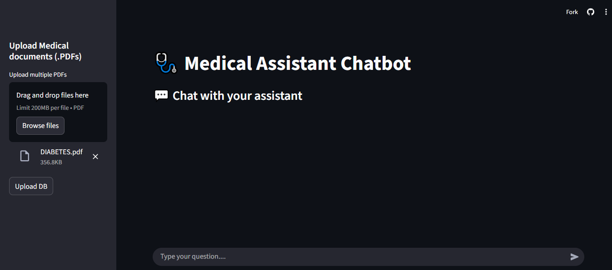

# 🩺 AI Medical Assistant — RAG-based Backend API



## 🧠 Project Overview

This project is a **Medical Domain AI Assistant Backend** built using **Retrieval-Augmented Generation (RAG)**.  
It allows users to upload medical PDFs (textbooks, reports, notes) and ask questions that are answered using **context retrieved from the uploaded documents**, reducing hallucinations and improving medical accuracy.

The system is implemented as a **FastAPI backend** exposing REST APIs for document ingestion and question answering.

---

## 🎓 What is RAG?

**Retrieval-Augmented Generation (RAG)** combines:
- 🔍 Information Retrieval (vector search from documents)
- 🤖 Large Language Models (LLMs)

Instead of answering purely from model memory, the system:
1. Retrieves relevant document chunks from a vector database
2. Injects them into the prompt
3. Generates grounded, context-aware answers

This is especially useful for **medical and factual domains**.

---

## 🔄 High-Level Architecture
              User Question

                   ↓

            Question Embedding

                   ↓

        Pinecone Vector Database

                   ↓

        Relevant Document Chunks

                   ↓

     RAG Chain (LangChain + Groq LLM)

                   ↓

              Final Answer


---

## ✨ Features

- Upload one or multiple **medical PDF documents**
- Automatic **PDF text extraction**
- Recursive **text chunking**
- Vector embeddings using **Google embeddings**
- Vector storage and similarity search via **Pinecone**
- Context-aware answer generation using **Groq LLaMA3-70B**
- Modular, scalable **FastAPI backend**
- Centralized logging and exception handling

---

## 🧰 Tech Stack

| Component | Technology |
|--------|-----------|
| Backend Framework | FastAPI |
| LLM | Groq (LLaMA3-70B) |
| Embeddings | Google Generative AI |
| Vector Database | Pinecone |
| RAG Framework | LangChain |
| Language | Python |
| API Style | REST |

---

## 📚 API Endpoints

### ➤ Upload PDFs
```

POST /upload_pdfs/

```
**Description:**  
Upload one or more PDF files for ingestion into the vector database.

---

### ➤ Ask a Question
```

POST /ask/

```
**Description:**  
Ask a question based on the uploaded documents.

**Form Field:**
- question` — User query
```

## 🗂️ Backend Structure & File Organization

server/
├── main.py                  # FastAPI application entry point
├── logger.py                # Centralized logging configuration
├── test.py                  # Backend testing / sandbox file
├── .env                     # Environment variables (API keys, configs)
├── requirements.txt         # Backend dependencies
│
├── middlewares/             # Custom FastAPI middlewares
│   └── exception_handlers.py  # Global exception handling middleware
│
├── modules/                 # Core business logic & RAG pipeline
│   ├── llm.py               # LLM initialization (Groq, prompts)
│   ├── load_vectorstore.py  # Pinecone vector store setup & loading
│   ├── pdf_handlers.py      # PDF loading, text extraction & chunking
│   └── query_handlers.py    # RAG query execution logic
│
├── routes/                  # API route definitions
│   ├── upload_pdfs.py       # PDF upload & ingestion endpoints
│   └── ask_question.py      # Question answering endpoint
│
├── uploaded_docs/           # Uploaded PDF storage
│   └── *.pdf
│
└── __pycache__/             # Python cache files

